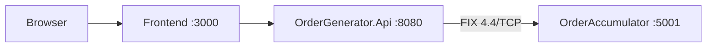

# Flowa Challenge


[](https://qlty.sh/gh/pedrogmoreira/projects/Flowa-Challenge)
[](https://qlty.sh/gh/pedrogmoreira/projects/Flowa-Challenge)


A microservices-based order management system using FIX 4.4 protocol for inter-service communication.

## Technologies

- C# / ASP.NET Core 9
- QuickFIX/n 1.14.0 (FIX 4.4 protocol)
- React 18 + Vite
- Nginx
- Docker + Docker Compose

## Architecture



### Services

| Service | Technology | Port | Responsibility |
|---|---|---|---|
| `OrderGenerator.Frontend` | React + Vite + Nginx | 3000 | Order form and execution result display |
| `OrderGenerator.Api` | ASP.NET Core Web API | 8080 | Receives orders, sends FIX NewOrderSingle, returns ExecutionReport |
| `OrderAccumulator` | ASP.NET Core Worker Service | 5001 (FIX) | Accepts FIX messages, calculates financial exposure per symbol |

## FIX 4.4 Contract

Communication between `OrderGenerator.Api` and `OrderAccumulator` uses the FIX 4.4 protocol via QuickFIX/n.

| Message | Tag 35 | Direction | Description |
|---|---|---|---|
| NewOrderSingle | D | Generator → Accumulator | New order submission |
| ExecutionReport | 8 | Accumulator → Generator | Full fill confirmation |

### Key FIX Fields

| Field | Tag | Description |
|---|---|---|
| Symbol | 55 | Asset symbol (PETR4, VALE3, VIIA4) |
| Side | 54 | 1 = Buy, 2 = Sell |
| OrderQty | 38 | Order quantity |
| Price | 44 | Order price |
| ClOrdID | 11 | Unique order ID for correlation |
| OrdStatus | 39 | 2 = Filled |

## Financial Exposure

The `OrderAccumulator` calculates financial exposure per symbol:

```
Exposure = Σ(price × qty) buys - Σ(price × qty) sells
```

Buy orders increase exposure, sell orders decrease it.

## How to install and run

### Prerequisites

- Docker
- Docker Compose

### Start all services

```bash
docker compose up
```

Access the frontend at `http://localhost:3000`.

### Run without Docker

**OrderAccumulator:**
```bash
cd src/OrderAccumulator
dotnet run
```

**OrderGenerator.Api:**
```bash
cd src/OrderGenerator.Api
dotnet run
```

**Frontend:**
```bash
cd src/OrderGenerator.Frontend
npm install
npm run dev
```

Access the frontend at `http://localhost:5173`.

## Order Validation

| Field | Rule |
|---|---|
| Symbol | Must be PETR4, VALE3 or VIIA4 |
| Side | Must be Buy or Sell |
| Quantity | Positive integer, less than 100,000 |
| Price | Positive decimal, multiple of 0.01, less than 1,000 |

## Tests

### Unit Tests

**OrderAccumulator.Tests**

| Test | Description |
|---|---|
| `Apply_BuyOrder_IncreasesExposure` | Buy order correctly increases symbol exposure |
| `Apply_SellOrder_DecreasesExposure` | Sell order correctly decreases symbol exposure |
| `Apply_BuyThenSell_CalculatesNetExposure` | Net exposure is calculated correctly after buy and sell |
| `Apply_MultipleSymbols_TracksExposureIndependently` | Each symbol tracks its own exposure independently |
| `GetExposure_UnknownSymbol_ReturnsZero` | Unknown symbol returns zero exposure |

**OrderGenerator.Api.Tests**

| Test | Description |
|---|---|
| `ToNewOrderSingle_BuyOrder_SetsSideCorrectly` | Buy order maps to FIX Side.BUY correctly |
| `ToNewOrderSingle_SellOrder_SetsSideCorrectly` | Sell order maps to FIX Side.SELL correctly |
| `ToNewOrderSingle_SetsSymbolCorrectly` | Symbol is mapped correctly to FIX tag 55 |
| `ToNewOrderSingle_GeneratesUniqueClOrdIDs` | Each order generates a unique ClOrdID for FIX correlation |
| `ToNewOrderSingle_SetsQuantityAndPriceCorrectly` | Quantity and price are mapped correctly to FIX tags 38 and 44 |

### Running Unit Tests

```bash
dotnet test
```

### E2E Tests (Cypress)

**OrderGenerator.Frontend**

| Test | Description |
|---|---|
| `should display the order form` | All form fields and submit button are visible |
| `should submit a valid order and display execution result` | Full happy path: order submitted and ExecutionReport displayed |
| `should block submission with empty quantity` | HTML5 validation blocks submission without quantity |
| `should block submission with empty price` | HTML5 validation blocks submission without price |

### Running E2E Tests

Make sure all services are running:

```bash
docker compose up
```

Run Cypress pointing to the frontend container:

```bash
cd src/OrderGenerator.Frontend
npx cypress run --config baseUrl=http://localhost:3000
```

## Architectural Decisions

### FIX 4.4 for inter-service communication
FIX 4.4 was used as required by the challenge specification. In a real-world scenario, internal service-to-service communication would typically use Kafka or gRPC, with FIX reserved for external counterparty integration (exchanges, prime brokers).

### Request/Response Correlation
Since FIX is asynchronous, a `ConcurrentDictionary<ClOrdID, TaskCompletionSource>` bridges the synchronous HTTP request with the asynchronous `ExecutionReport` callback.

### decimal over double
All financial calculations use `decimal` to avoid binary floating-point precision errors inherent to `float` and `double`.

### Central Package Management
NuGet package versions are managed centrally via `Directory.Packages.props`, ensuring version consistency across all projects.

---

This is a challenge by [Coodesh](https://coodesh.com)
